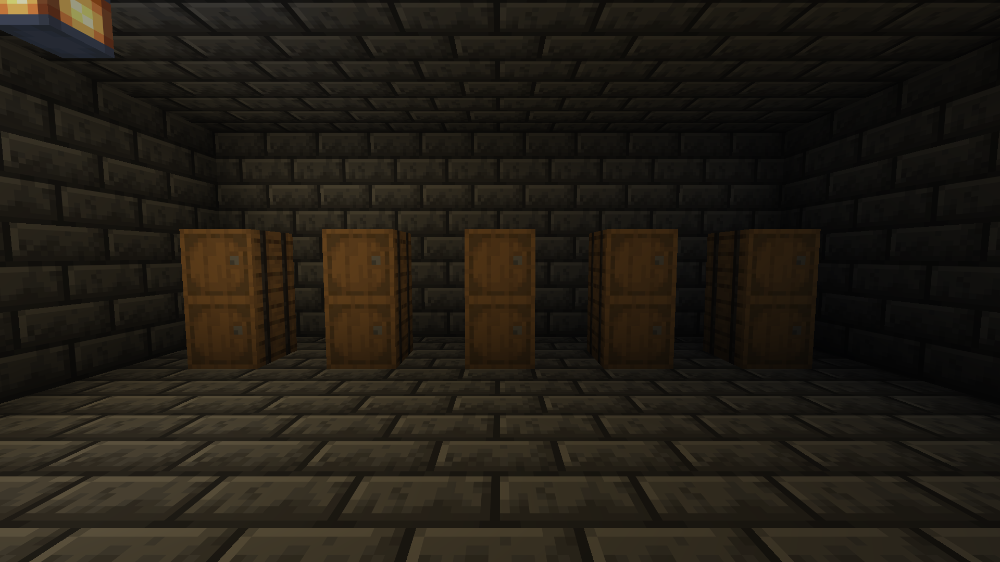
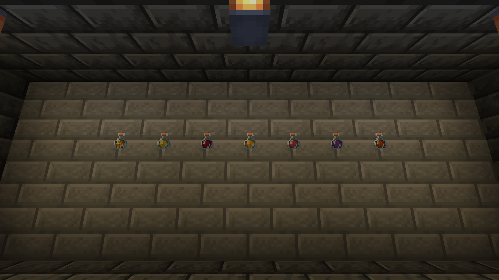

# Let's Cook

A Fabric mod that rounds out vanilla cooking: smoking as a craft of its own, cheese, pies, stews,
drinks, and a reason to eat something other than whichever food has the biggest number.

## Screenshots

## What This Mod Does

Vanilla's kitchen converges on one meat, and most of its stations are the same station at
different speeds. This gives foods reasons to exist that are not the size of the bar they restore:
a smoked meat you can eat when full, a stew that carries an effect its ingredients would have told
you about, a cheese that gets sharper the longer you forget about it.

Server-side; Pandorical carries the client's half. Nothing here needs a new station. The smoker,
the furnace, the campfire, the barrel and the crafting grid do all of it.

## Smoking Is Not A Faster Furnace

**A smoker burns wood, and only wood.** Smoke is the whole mechanism, so what goes in the firebox
matters. Anything in the log tag counts, so another mod's wood works without being listed; coal,
planks and every other fuel are refused.

**Smoking makes something else of meat.** The seven vanilla smoking recipes for meat and fish now
produce a smoked version instead of the cooked one. Smoked meat carries two more points of
nutrition than cooked, and because smoking is how you keep meat rather than how you serve it, it
can be eaten when you are already full. That second part is the point: a bigger number only shifts
which food everyone carries, and being edible when full is a different thing to reach for.

Smoked foods wear their cooked counterpart's look. It is the same meat, kept differently.

**Only ingredients smoke.** A stew or a pie put in a smoker comes out exactly as the furnace would
have made it. Smoking is something you do to an ingredient, not to a dish.

## Meat Is Named For What It Is

Four vanilla meats are renamed, and every animal that plausibly has meat on it drops some.

| Vanilla item | Now called |
|--------------|------------|
| Porkchop | White Meat |
| Beef | Fatty Red Meat |
| Mutton | Lean Red Meat |
| Chicken | Poultry |

Beef is the fatty one because its picture is: the marbling is right there on the icon, and mutton's
is the leaner cut. The names follow the meat through cooking and smoking: Raw Fatty Red Meat, Cooked
Fatty Red Meat, Smoked Fatty Red Meat. Rabbit, cod and salmon keep their names raw and cooked and become Smoked
Small Game, Smoked Whitefish and Smoked Oily Fish.

**Every animal worth butchering now gives meat, and the big ones give two cuts.** A carcass is not
one thing: an animal's main cut comes off it in quantity and a little of its second cut comes with.
Which way round depends on the animal rather than on how many you killed.

| Animal | Main cut | Second cut | Still drops |
|--------|----------|------------|-------------|
| Cow | Raw Fatty Red Meat 1-3 | Raw Lean Red Meat 0-1 | 0-2 leather |
| Mooshroom | Raw Fatty Red Meat 1-3 | Raw Lean Red Meat 0-1 | 0-2 leather |
| Panda | Raw Fatty Red Meat 1-2 | Raw Lean Red Meat 0-1 | 1 bamboo |
| Sniffer | Raw Fatty Red Meat 1-2 | Raw Lean Red Meat 0-1 | nothing else |
| Sheep | Raw Lean Red Meat 1-2 | Raw Fatty Red Meat 0-1 | its wool |
| Goat | Raw Lean Red Meat 1-2 | Raw Fatty Red Meat 0-1 | nothing else |
| Horse | Raw Lean Red Meat 1-2 | Raw Fatty Red Meat 0-1 | 0-2 leather |
| Donkey | Raw Lean Red Meat 1-2 | Raw Fatty Red Meat 0-1 | 0-2 leather |
| Mule | Raw Lean Red Meat 1-2 | Raw Fatty Red Meat 0-1 | 0-2 leather |
| Camel | Raw Lean Red Meat 1-2 | Raw Fatty Red Meat 0-1 | nothing else |
| Llama | Raw Lean Red Meat 1-2 | Raw Fatty Red Meat 0-1 | 0-2 leather |
| Trader Llama | Raw Lean Red Meat 1-2 | Raw Fatty Red Meat 0-1 | 0-2 leather |
| Wolf | Raw Lean Red Meat 1-2 | Raw Fatty Red Meat 0-1 | nothing else |
| Polar Bear | Raw Lean Red Meat 1-2 | Raw Fatty Red Meat 0-1 | 0-2 cod, 0-2 salmon |
| Pig | Raw White Meat 1-3 | - | nothing else |
| Hoglin | Raw White Meat 2-4 | - | 0-1 leather |
| Parrot | Raw Poultry 1-2 | - | 1-2 feather |
| Chicken | Raw Poultry 1 | - | 0-2 feather |
| Fox | Raw Rabbit 1-2 | - | nothing else |
| Armadillo | Raw Rabbit 1-2 | - | nothing else |
| Cat | Raw Rabbit 1 | - | 0-2 string |
| Ocelot | Raw Rabbit 1 | - | nothing else |
| Rabbit | Raw Rabbit 1 | - | hide, foot |
| Squid | Raw Cod 1-2 | - | 1-3 ink sac |
| Glow Squid | Raw Cod 1-2 | - | 1-3 glow ink sac |
| Nautilus | Raw Cod 1-2 | - | its shell |

**Only the red meats come in two cuts**, because only red meat has two. Pork and poultry are one
thing each in this mod's vocabulary, so a pig gives white meat and nothing else, and no red meat
ever comes off one. The small animals are one cut because they are one mouthful.

**Lean is the default for anything that runs.** Horse, camel, goat, llama and wolf are all lean
meats in life, and a polar bear is lean with fat laid over it. The two that go the other way are the
ones that spend their lives eating: a cow and a panda are mostly fat, with some lean on them.

**The small ones are small game.** Foxes, armadillos, cats and ocelots give raw rabbit, which this
mod smokes into Smoked Small Game - a name that was already in the game for a whole class of animal
and, until now, only ever came off a rabbit.

**The squid are whitefish.** Squid, glow squid and nautilus give raw cod, which smokes into Smoked
Whitefish. A nautilus is worth killing for the first time: its shell is a one-in-twenty drop and
only to a player, so until now most of them were worth nothing at all.

Looting adds up to one more per level, the way it does on a cow, and that goes for second cuts as
well. Every drop here comes out cooked if the animal died on fire - and for the polar bear that goes
for its fish too. Nothing an animal dropped before was taken away; the meat is added beside it.
Chicken, pig, rabbit and hoglin are in the table for completeness and are entirely untouched.

Wolves, cats and ocelots are in that table, tame ones included. If you keep companions, that is
worth knowing before you swing at one.

## Dishes

Cooking that puts something in a bowl. Every dish is shapeless in the crafting grid, stacks to
sixteen like honey, and hands the bowl back when eaten. Nutrition stays inside vanilla's stew
range on purpose: what cooking buys is the trip home you do not have to make, not a bigger number.

**Savoury dishes carry an effect.** Short, always level one, and always something the ingredients
would have told you.

| Dish | Ingredients | Effect |
|------|-------------|--------|
| Vegetable Soup | bowl, carrot, potato, beetroot | Night Vision, 30s |
| Meat Stew | bowl, any cooked or smoked meat, carrot, potato | Strength, 45s |
| Potato Chowder | bowl, two baked potatoes, milk bucket | Resistance, 45s |
| Fish Chowder | bowl, any cooked or smoked fish, baked potato, milk bucket | Water Breathing, 45s |

**Puddings are always edible.** There is always room for pudding, which is worth more than a
number when your hunger bar is full and you want to top up before a fight.

| Pudding | Ingredients | Effect |
|---------|-------------|--------|
| Bread Pudding | bowl, bread, egg, sugar | none |
| Fruit Salad | bowl, sweet berries, melon slice, apple | none |
| Ice Cream | bowl, two snowballs, milk bucket, sugar | none |
| Berry Ice Cream | ice cream, sweet berries | Speed, 30s |
| Melon Ice Cream | ice cream, melon slice | Regeneration, 8s |
| Glow Berry Ice Cream | ice cream, glow berries | Glowing, 30s |
| Cookie Ice Cream | ice cream, cookie | Haste, 30s |

**Two of them are not really dishes.** Nether Chili is crimson fungus, warped fungus and nether
wart in a bowl: edible in the sense that you can put it in your mouth, and it poisons you for it.
Cooking it is the point. Smelt it and out comes the Nether Loaf, the one thing here that leaves the
bowl behind because the bowl went in the furnace too. The loaf stacks to sixty-four and grants Fire
Resistance for forty-five seconds, since it is made entirely of the nether.

Sugar also smelts from beetroot, two at a time, so a sugar farm is a beetroot farm.

## Cheese

**Milk in a dark barrel becomes cheese.** Put a milk bucket in a barrel that is underground, with no
sky above it and a block light of seven or less, and a day later it is a Bucket of Cheese. Pour it
out and it is a wheel: right-click to cut a slice, seven slices to a wheel, and the bucket comes
back when the wheel is placed.

**Smoked cheese keeps.** A bucket of cheese through the smoker becomes smoked cheese, which is
richer and, like smoked meat, can be eaten when full.

**Forgetting about it is rewarded.** Cheese left three times its minimum comes out Aged. The tier
rides on the bucket and is spent when the wheel is placed: every slice from an aged wheel is
sharper and richer than a slice from a plain one.

## Drinks

Beer, a wine for every fruit worth pressing, mead, and one spirit. Each is made twice.

**Crafting gets you a starter.** A water bottle, sugar and the source: wheat for beer, or an apple,
sweet berries, glow berries, a melon slice or chorus fruit for the wines.

**Mead is the one that takes no sugar.** Two water bottles and a honey bottle, and nothing else.
Every other starter needs something for the yeast to work on that the fruit alone will not give it;
honey already is that, so asking for sugar beside it was asking twice for the same thing.

**And mead is the one that makes two.** Honey is thick enough to let down, so the three bottles come
out as two of mash and the honey's empty glass, which is the same three bottles you put in. Every
other starter is one bottle in and one out.

A starter is not a drink and does not pretend to be. It has no food value at all, and its name says
so.

**A cellar makes it a drink.** In a barrel that qualifies (underground, dark, see Cheese), beer is
ready in half a day, and wine and mead in a day and a half. Every finished drink restores a little, is always
drinkable on a full stomach, hands the bottle back, stacks to sixteen, and takes the edge off:
Nausea, Weakness and Mining Fatigue are cleared by any of them. Poison and Wither are deliberately
not, because being able to drink off real damage is a different power.

| Drink | Starter recipe | In the barrel | Effect |
|-------|----------------|---------------|--------|
| Beer | water bottle, sugar, wheat | half a day | Strength, 45s |
| Apple Wine | water bottle, sugar, apple | a day and a half | Regeneration, 6s |
| Berry Wine | water bottle, sugar, sweet berries | a day and a half | Speed, 45s |
| Glow Berry Wine | water bottle, sugar, glow berries | a day and a half | Night Vision, 45s |
| Melon Wine | water bottle, sugar, melon slice | a day and a half | Absorption, 60s |
| Chorus Wine | water bottle, sugar, chorus fruit | a day and a half | Slow Falling, 45s |
| Mead | two water bottles, honey bottle (makes two) | a day and a half | Resistance, 45s |
| Beetroot Vodka | water bottle, sugar, beetroot | three days | Fire Resistance, 45s |

**Beetroot vodka is the long one.** Three days in the dark, which is twice any wine, and the barrel
says `(Distilling)` rather than fermenting while it works. It is the only drink here you set out to
make rather than one that happened to a fruit, and the only one that carries Fire Resistance -
which, given what it is, it ought to.

**A wine, mead or vodka left three times its minimum comes out Aged**, and its effect lasts twice as
long. The same drink, and what you waited for is having to drink fewer of them.

## How A Barrel Works

One rule for cheese, beer, wine and mead, so they are one mechanic with different tables rather than
three that drift.

**Underground and dark.** Sky light must be zero and block light seven or less. Both are read in
the room beside the barrel, the brightest of its six sides, not at the barrel itself: the light
inside a solid block is always nought, so reading it there would make a barrel in a sunny field a
cellar. Sky light rather than the combined brightness, because the combined figure falls at dusk: a
barrel in a field would qualify every night and stop at dawn, and the rule would look random to
anyone who found it by accident.

**The name tells you where it is.** A barrel is opaque, and milk that is working looks exactly like
milk that is not. So the stack says so: a starter reads `(Starter)` in your pack, `(Brewing)` or
`(Fermenting)` once a barrel has it, and milk reads `(Ageing)`. The moment the barrel stops
qualifying the suffix goes and the clock resets, so a mistake is visible the next time you look.

**With [block-tip](https://github.com/fatlard1993/block-tip) installed, a closed barrel can be
read.** Looking at one names the first thing fermenting in it and what it is becoming, and how it
is getting on: `Ageing 40%` (or `Brewing`, `Fermenting`) while it works, `Ready: open it` once the
minimum has passed, and `Too bright to age` when the room will not do. Anything in a dark barrel is working from the
moment it goes in, so there is always a percentage to read.

**Nothing has to stay loaded.** Time is counted from a stamp on the stack rather than by ticking
the barrel. Come back in a week and it finished a week ago. The barrel is checked when it is opened,
closed or filled (a hopper counts), and when somebody looks at it with block-tip, which between
them cover every moment anything goes in or anyone could care, and a barrel with nothing fermenting
in it costs nothing at all. A hopper hands a barrel one item at a time; starters of one kind that
arrive within half a minute of each other are one batch, and stack as one.

**Nothing collects it for you**, which is why the wait past the minimum is real and worth paying
for. Whole stacks finish together: they all went in together and they all had the same week.

## Pies, And A Cake

**A pie is made in its tin.** A bucket, the fruit, sugar, an egg and wheat make a raw pie, which is not
food: it is a bucket of wet filling, and the oven is the point of it. Smelt it for a whole pie.
Put that down and it is a block you cut slices from, seven to a pie, three points of hunger each,
and the bucket comes back.

Pumpkin, sweet berry and glow berry. The glow berry pie gives off light, because the berries did.

**Vanilla's pumpkin pie is now the Pumpkin Tart.** It is unchanged in every other way - same recipe,
same food, still a thing you hold in one hand. The rename is so the two can sit next to each other
and say which is which: a tart is the single serving you carry, and a pie is the block on the table
that seven people cut a slice from.

**Chocolate Cake** is a cake and cocoa beans, and is its own block with its own seven slices.

A slice is never refused: cake, cheese and pie are cut whether or not you are hungry, vanilla's
cake included. Every slice cut off a block, cake, cheese or pie, makes the eating sound and throws crumbs off the face just cut. Vanilla's own cake gets the same, since it was the one food in the game eaten in silence.

## Snacks

Food you carry, that is not meat and does not come in a bowl.

- **Hardboiled Egg**: an egg through the furnace, the smoker or over a campfire. Vanilla has no way
  to eat the most obvious food an animal makes, and being food at all is the point. The smoker
  boils it rather than smoking it: an egg in its shell takes no smoke.
- **Meat Sandwich**: bread, any cooked or smoked meat, and kelp. A packed lunch with no effect. The
  effects live on the bowl dishes, which cost a station and a bowl.
- **Sushi**: dried kelp and raw cod or salmon. No wheat: the kelp is the wrap and the fish is
  the rest of it.
- **Caramel Apple**: apple, sugar and a stick. A pudding, so there is always room for one.
- **Cactus Juice**: crouch and right-click a cactus with an empty glass bottle. A cactus is a plant
  full of water standing in the one biome with none. It must have grown a little first, and tapping
  it sets its growth back to nothing, which is a price you can see in your farm rather than a hidden
  timer. Always drinkable, bottle back, stacks to sixteen.

## Every Recipe

The whole menu in one place. Everything in the grid is shapeless, so the ingredients go anywhere in
it. Where a recipe says "any", it means a tag, and another mod's item in that tag works too.

**In the crafting grid**

| Makes | From |
|-------|------|
| Vegetable Soup | bowl, carrot, potato, beetroot |
| Meat Stew | bowl, any cooked or smoked meat, carrot, potato |
| Potato Chowder | bowl, two baked potatoes, milk bucket |
| Fish Chowder | bowl, any cooked or smoked fish, baked potato, milk bucket |
| Nether Chili | bowl, crimson fungus, warped fungus, nether wart |
| Bread Pudding | bowl, bread, egg, sugar |
| Fruit Salad | bowl, sweet berries, melon slice, apple |
| Ice Cream | bowl, two snowballs, milk bucket, sugar |
| Berry Ice Cream | ice cream, sweet berries |
| Melon Ice Cream | ice cream, melon slice |
| Glow Berry Ice Cream | ice cream, glow berries |
| Cookie Ice Cream | ice cream, cookie |
| Chocolate Cake | cake, cocoa beans |
| Raw Pumpkin Pie | bucket, pumpkin, sugar, egg, wheat |
| Raw Sweet Berry Pie | bucket, sweet berries, sugar, egg, wheat |
| Raw Glow Berry Pie | bucket, glow berries, sugar, egg, wheat |
| Meat Sandwich | bread, any cooked or smoked meat, kelp |
| Sushi | dried kelp, raw cod or salmon |
| Caramel Apple | apple, sugar, stick |
| Beer Starter | water bottle, sugar, wheat |
| Apple Wine Starter | water bottle, sugar, apple |
| Berry Wine Starter | water bottle, sugar, sweet berries |
| Glow Berry Wine Starter | water bottle, sugar, glow berries |
| Melon Wine Starter | water bottle, sugar, melon slice |
| Chorus Wine Starter | water bottle, sugar, chorus fruit |
| Mead Starter (makes two) | two water bottles, honey bottle |
| Beetroot Vodka Starter | water bottle, sugar, beetroot |

"Any cooked or smoked meat" is fatty red meat, lean red meat, white meat, poultry or rabbit, cooked
or smoked - remembering that the smoked ones are Smoked Small Game rather than Smoked Rabbit. "Any
cooked or smoked fish" is cooked cod or salmon, or Smoked Whitefish or Smoked Oily Fish.

**In the furnace or the smoker**

| Makes | From | Where |
|-------|------|-------|
| Whole Pumpkin Pie | raw pumpkin pie | furnace or smoker |
| Whole Sweet Berry Pie | raw sweet berry pie | furnace or smoker |
| Whole Glow Berry Pie | raw glow berry pie | furnace or smoker |
| Nether Loaf | nether chili | furnace or smoker |
| Hardboiled Egg | egg | furnace, smoker or campfire |
| Sugar (two) | beetroot | furnace |
| Smoked Cheese | bucket of cheese | smoker |
| The seven smoked meats | the raw meat or fish | smoker |

Remember the smoker only burns wood. The pies and the loaf come out of a smoker exactly as the
furnace would have made them: smoking is something you do to an ingredient, not to a dish.

**In a barrel, underground and dark**

| Makes | From | How long |
|-------|------|----------|
| Bucket of Cheese | milk bucket | a day |
| Beer | beer starter | half a day |
| Apple, Berry, Glow Berry, Melon and Chorus Wine, and Mead | the matching starter | a day and a half |
| Beetroot Vodka | beetroot vodka starter | three days |

Left three times as long, cheese comes out Aged and a wine or mead comes out a vintage.

**With no station at all**

Cactus Juice: crouch and right-click a grown cactus with an empty glass bottle.

## Pandorical

Pandorical is required on the server; the mod will not load without it. Let's Cook registers every item and block through Pandorical's content sync, with its model and
its stack size, so Pandorical clients draw the food and agree with the server about how deep it
stacks. The cheese wheels and pies are registered as interactive, so a client does not predict a
block placement when a right-click is really a bite.

**The Pandorical mod must be installed client-side** to see any of this. Without it the server
still cooks, ages and pours everything, but a connecting client has no models for the new food and
draws it as the missing-texture placeholder.

## The butcher will teach you

With [village-quests](../village-quests) installed, a butcher takes apprentices,
and the six lessons are the six things this mod changed that the game will never
mention: that the smoker has stopped taking coal, that smoked meat goes down on
a full stomach, that a bowl carries the effect its ingredients implied, that
there is always room for pudding, that a barrel in a dark cellar is a cheese
press, and that the one dish which poisons you is meant to be cooked twice.

They are lessons rather than recipes. The apprenticeship is spaced by days, the
butcher hands over a barrel when the cheese lesson comes due, and finishing it
gets you a smoker of your own.

## And the village will ask you to cook

The rest of the menu comes up as work. A villager asks you to make something
for a neighbour, and says the recipe as they ask: the farmer wants a vegetable
soup taken to whoever keeps walking into things on the late watch, the
fisherman a fish chowder for the one who dives off the jetty after dropped
hooks. You cook it, hand it over, and the neighbour tells you what it did to
them, which is the effect or the twist the dish carries, said by somebody it
just happened to. Then the asker wants to hear how it went.

Each trade asks for what it would know: soup and pumpkin pie from farmers,
chowder and sushi from fishermen, ice cream and potato chowder from clerics, a
glow berry pie from librarians, beer from the smiths once they trust you, a
chocolate cake from leatherworkers once they trust you more. Any one of the dish
will do, and none of them repeat a butcher's lesson.

## Development

Installing and the art pipeline are in [DEVELOPMENT.md](DEVELOPMENT.md).

## License

MIT, see [LICENSE](LICENSE).
